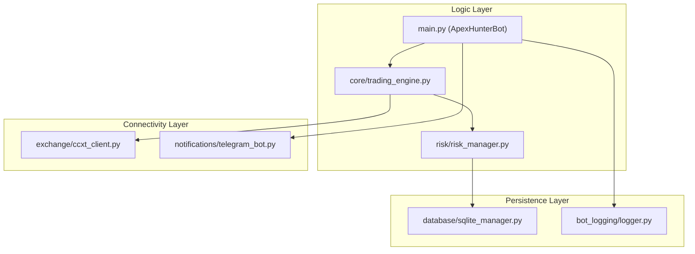

# Principal-Level Onboarding: Apex Hunter V14

**Audience**: Staff Engineers and Quantitative Architects.

## System Philosophy & Design Principles
The Apex Hunter (AH) is designed as a **Non-Custodial Multi-Exchange Execution Engine**. 

### Core Invariants:
1. **Zero-Balance State Safety**: No order is ever placed without the "Triple Safety Handshake" between Strategy, Risk, and Exchange (config/config.py:74).
2. **Forensic Traceability**: Every sub-second state change (Depth walls, Signal fire, Risk veto) is recorded in independent SQLite streams (database/sqlite_manager.py:32).
3. **Regime-Aware Execution**: The system defaults to "Silence" in low-volatility regimes (ADX < 25) to protect capital from "Death by a Thousand Cuts" (strategies/filters.py).

---

## Architecture Overview

---

## Key Abstractions

### 1. The 11-Layer Risk Chain
The `RiskManager` (risk/risk_manager.py:21) implements a sequential veto pattern. A trade only proceeds if all 11 disparate metrics (Position Sizing, Correlation, Daily Loss, etc.) return an `Approved` signal.

### 2. Forensic Persistence
The system separates high-value data (Trades) from high-volume data (Signals/Analysis) using two SQLite databases: `apex_hunter.db` and `activity_log.db` (database/sqlite_manager.py:17-18).

---

## Data Flow: Signal-to-Fill

1. **Scan Phase**: `main.py` fetches market depth via WSS (A6) or REST (A1-A4).
2. **Signal Phase**: Strategy generates `ProposedTrade` dict.
3. **Risk Phase**: `RiskManager` audits `ProposedTrade`.
4. **Execution Phase**: `CCXTExchangeClient` maps unified AH orders to exchange-specific parameters.
5. **Post-Fill Phase**: `TrailingStopLayer` (newly hardened) starts the real-time ratchet logic.

---

## Testing Strategy
- **Simulation**: `tests/comprehensive_system_check.py` mimics concurrent firing.
- **Forensics**: `tests/test_trailing.py` validates that ratchet events are recorded correctly in the SQLite stream.

---

## Known Technical Debt
- **Correlation Logic**: Currently uses a simplified position count (risk/layers/correlation_risk.py:10). Professional quantitative correlation (r-squared) matrix integration is planned for V15.
- **Rate Limiting**: Uses a static 0.8x buffer; needs dynamic volatility-based throttling.
